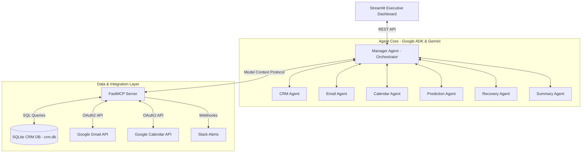

# 🛡️ Revenue Guardian: Autonomous Multi-Agent Revenue Operations Platform
### Google x Kaggle AI Agent Competition Submission | Theme: Agents for Business

Revenue Guardian is a production-quality, enterprise-grade Revenue Operations (RevOps) platform. It leverages **Google Agent Development Kit (ADK)**, **Model Context Protocol (MCP)**, and **Gemini 2.0** to autonomously detect revenue leakage, audit billing discrepancies, predict customer churn, and execute recovery campaigns with strict **Human-in-the-Loop (HITL)** governance.

---

## 📖 The Business Problem
In B2B SaaS, companies lose **3% to 5% of their Annual Recurring Revenue (ARR)** to "revenue leakage" due to operational silos:
*   **Contract-to-Billing Discrepancies**: Customer subscriptions in Stripe do not match the negotiated terms in signed PDF contracts (e.g., missed renewals, wrong tier pricing).
*   **Siloed Telemetry**: Product usage databases are isolated from CRM systems (Salesforce/HubSpot). Overage charges go unbilled, and sudden drops in usage (churn signals) are missed.
*   **Communication Gaps**: Account managers miss follow-ups on stalled deals, or fail to respond to technical blockers in customer emails.

---

## 🏗️ Technical Architecture
Revenue Guardian is built around clean architecture principles, separating cognitive reasoning, integration protocols, and presentation layers.



For detailed system and process flows, see:
*   [Architecture Diagrams](file:///c:/Users/ritik/OneDrive/Desktop/SummerGrind26'/AI AGENTS 5 DAYS KAGGLE/CapstoneProject/docs/architecture_diagrams.md)
*   [Workflow Diagrams](file:///c:/Users/ritik/OneDrive/Desktop/SummerGrind26'/AI AGENTS 5 DAYS KAGGLE/CapstoneProject/docs/workflow_diagrams.md)

---

## 🤖 The Multi-Agent Team

Using **Google ADK**, we define a team of seven specialized agents that collaborate to audit and secure revenue:

1.  **Manager Agent (Orchestrator)**: Coordinates the pipeline. It runs extraction agents in parallel, manages the shared context state machine, aggregates Pydantic outputs, and handles subagent failures gracefully.
2.  **CRM Intelligence Agent**: Audits the pipeline, detecting qualified but inactive leads and identifying deals stalled in stages (e.g., >30 days in *Proposal*).
3.  **Email Intelligence Agent**: Scans customer threads using Gemini to perform sentiment analysis, urgency detection, intent classification, and ghosting detection.
4.  **Calendar Agent**: Identifies missed meetings (no-shows) and overdue follow-up tasks from calendar event descriptions.
5.  **Revenue Prediction Agent**: Runs risk-weighted models to calculate opportunity win probabilities, revenue at risk (expected churn loss), and a 30-day multi-scenario revenue forecast.
6.  **Recovery Strategy Agent**: Synthesizes all risk signals to draft concrete action plans (calls, emails, manager escalations, or overage discounts) with confidence scores.
7.  **Executive Summary Agent**: The final synthesizer. Generates a 3-sentence morning briefing, a detailed markdown executive report, and dashboard-ready KPIs.

---

## 🔌 Model Context Protocol (MCP) Server
The platform utilizes a unified **FastMCP Server** that exposes secure, schema-validated tools. This decouples the agent's cognitive reasoning from the underlying infrastructure:
*   `read_crm()` & `update_crm_opportunity()`: Interacts with the local SQLite CRM database.
*   `read_emails()` & `create_gmail_draft()`: Connects to the **Google Gmail API** (with zero-config mock fallback).
*   `read_calendar()` & `schedule_meeting()`: Connects to the **Google Calendar API** (with zero-config mock fallback).
*   `notify_slack()`: Dispatches alerts to your Slack workspace via webhooks.
*   `save_logs()`: Persists agent execution logs in our SQL audit database.

---

## 🔐 Security & Governance
*   **Role-Based Access Control (RBAC)**: Protects endpoints and service functions. The `CFO` role is required to approve billing adjustments, while `Sales_Reps` can approve email drafts.
*   **Human-in-the-Loop (HITL)**: High-risk mutations (sending client emails, modifying Stripe subscriptions) cannot be executed autonomously. They are queued as "Pending Approvals" and require manual sign-off via the dashboard.
*   **Audit Logging**: Every agent decision, tool call, and user action is written to a read-only `audit_logs` table in SQLite, providing a compliance trail.

---

## 🚀 Getting Started (Local Setup)

### 1. Clone & Install Dependencies
Clone the repository and install the locked Python dependencies:
```bash
pip install -r requirements.txt
```

### 2. Configure Environment Variables
Copy the configuration template and add your Google Gemini API Key:
```bash
cp .env.example .env
```
Open `.env` and configure:
```env
GEMINI_API_KEY=your_google_ai_studio_api_key
JWT_SECRET_KEY=your_secure_hex_signing_key
```

### 3. Google API Configuration (Optional)
To enable live Gmail and Calendar integrations:
1.  Go to the [Google Cloud Console](https://console.cloud.google.com/).
2.  Create a project, enable the Gmail and Google Calendar APIs, and configure the OAuth consent screen.
3.  Create OAuth 2.0 Desktop credentials, download the JSON file, rename it to `credentials.json`, and place it in the project root.
4.  On the first run, a browser tab will open asking you to authenticate. The access tokens will be saved locally in `token.json` and `token_calendar.json`.
*(If `credentials.json` is not found, the platform automatically runs in **Mock Mode** using our high-fidelity mock datasets, allowing immediate testing).*

### 4. Run the Executive Dashboard
Start the Streamlit dashboard:
```bash
streamlit run app.py
```
Open your browser to `http://localhost:8501`. Click **"Run Autonomous Audit"** in the sidebar to trigger the multi-agent workflow and watch the **Live Agent Activity** panel stream the execution in real time!

---

## 🧪 Running the Test Suite
The project includes a comprehensive Pytest suite that verifies the security layers, audit logging, and MCP tools using an isolated, temporary database context.

To run the tests:
```bash
pip install pytest
pytest -v
```

---

## 📦 Containerization & Deployment
*   **Local Docker**: Spin up the backend and dashboard services using Docker Compose:
    ```bash
    docker-compose up --build
    ```
*   **Production Cloud**: For details on deploying to **Google Cloud Run** and configuring **GCP Secret Manager**, refer to our [Deployment Guide](file:///c:/Users/ritik/OneDrive/Desktop/SummerGrind26'/AI AGENTS 5 DAYS KAGGLE/CapstoneProject/docs/deployment.md).

---

## 📁 Directory Structure
```text
revenue_guardian/
├── config/
│   └── settings.py          # Global configurations & .env loader
├── docs/
│   ├── architecture_diagrams.md  # System topology and agent flows
│   ├── workflow_diagrams.md      # Process playbooks and HITL lifecycles
│   └── deployment.md             # GCP Cloud Run deployment guide
├── models/
│   └── domain.py            # Pydantic data schemas
├── agents/
│   ├── orchestrator.py      # Manager Agent
│   ├── crm_agent.py         # CRM Agent
│   ├── email_agent.py        # Email Agent
│   ├── calendar_agent.py     # Calendar Agent
│   ├── prediction_agent.py   # Prediction Agent
│   ├── recovery_agent.py     # Recovery Agent
│   └── summary_agent.py      # Summary Agent
├── mcp/
│   ├── server.py            # FastMCP Server
│   ├── crm_tools.py         # SQLite database tools
│   ├── gmail_tools.py       # Google Gmail API tools
│   ├── calendar_tools.py    # Google Calendar API tools
│   └── slack_tools.py       # Slack webhook tools
├── services/
│   └── audit_service.py     # SQLite audit logging service
├── scheduler/
│   └── cron_jobs.py         # Daily workflow scheduling loop
├── security/
│   ├── auth.py              # JWT authentication & PBKDF2 hashing
│   └── rbac.py              # Role-Based Access Control
├── tests/
│   ├── conftest.py          # Pytest database fixtures
│   ├── test_mcp.py          # MCP tool unit tests
│   └── test_services.py     # Security & logging unit tests
├── app.py                   # Streamlit Executive Dashboard
├── requirements.txt         # Project dependencies
├── Dockerfile               # Application dockerfile
└── docker-compose.yml       # Multi-container orchestration
```
