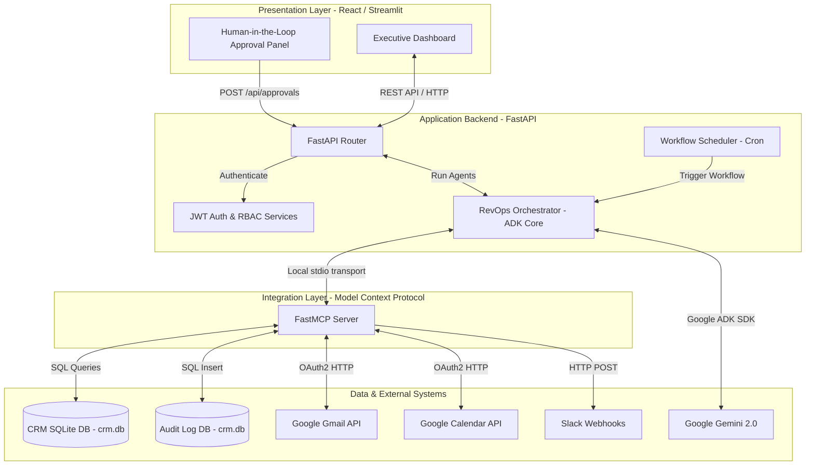
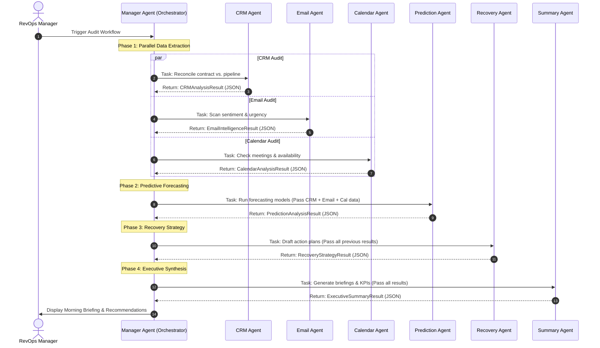
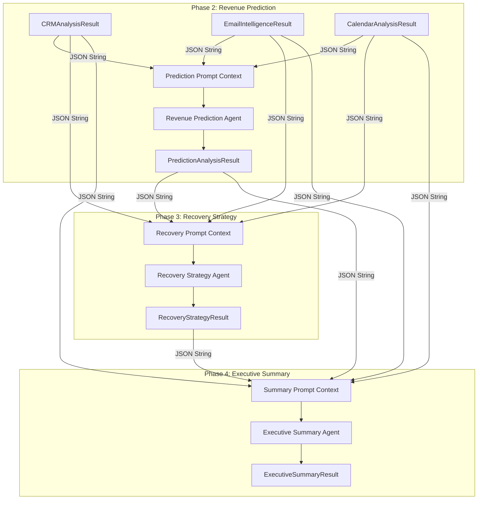
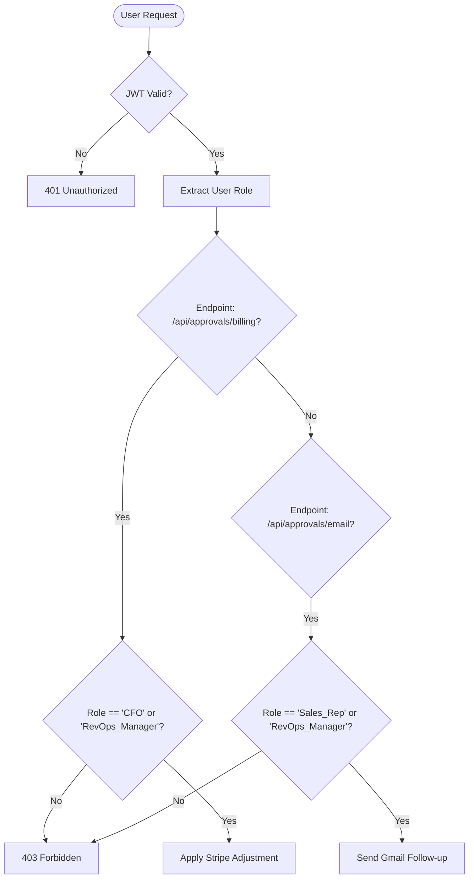

# Revenue Guardian: Architecture Diagrams

This document contains a set of Mermaid diagrams visualizing the architecture, agent interaction flows, data flows, and security boundaries of the **Revenue Guardian** platform.

---

## 1. System Topology Diagram
Visualizes the overall system structure, separating the Presentation Layer, the Application Backend, the MCP Integration Server, and the data sources.

---

## 2. Multi-Agent Execution Pipeline
Illustrates the lifecycle of a single RevOps audit run, highlighting the parallel execution of the data-gathering agents followed by the sequential synthesis agents.

---

## 3. Data Flow & Shared Context Map
Shows how Pydantic data models are passed as JSON string messages to maintain a shared context across the decentralized agent core.

---

## 4. Security & RBAC Boundary
Illustrates the authentication and authorization (RBAC) boundaries protecting the system's endpoints and tools.

