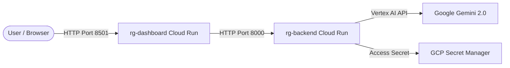

# Google Cloud Run Deployment Guide: Revenue Guardian

This guide describes how to deploy the **Revenue Guardian** platform (FastAPI Backend + Streamlit Dashboard) to **Google Cloud Run** using the Google Cloud SDK (`gcloud` CLI).

---

## Architecture Overview

On Google Cloud, the platform is deployed as two decoupled, serverless services:
1.  **`rg-backend`**: Hosts the FastAPI application. It executes the ADK agents and mounts the MCP tools. It accesses Google Gemini via Vertex AI / Vertex credentials and retrieves secrets from GCP Secret Manager.
2.  **`rg-dashboard`**: Hosts the Streamlit executive dashboard. It communicates with the backend via HTTP and is exposed to the public.



---

## Step 1: Prerequisites & Initial Setup

### 1. Install Google Cloud SDK
Ensure you have the `gcloud` CLI installed and authenticated:
```bash
gcloud auth login
gcloud auth configure-docker
```

### 2. Configure Your Project
Set your target GCP Project ID:
```bash
gcloud config set project YOUR_GCP_PROJECT_ID
```

### 3. Enable Required Google APIs
Enable the serverless, container, and security APIs needed for the deployment:
```bash
gcloud services enable \
    run.googleapis.com \
    defines.googleapis.com \
    artifactregistry.googleapis.com \
    cloudbuild.googleapis.com \
    secretmanager.googleapis.com
```

---

## Step 2: Configure GCP Secret Manager

For security compliance, we do not store API keys or JWT secrets in environment variables. Instead, we store them in **Secret Manager** and mount them directly to the Cloud Run containers on startup.

### 1. Create the Secrets
```bash
# Create the Gemini API Key secret
gcloud secrets create GEMINI_API_KEY --replication-policy="automatic"
echo -n "your_gemini_api_key" | gcloud secrets versions add GEMINI_API_KEY --data-file=-

# Create the JWT Secret Key
gcloud secrets create JWT_SECRET_KEY --replication-policy="automatic"
openssl rand -hex 32 | tr -d '\n' | gcloud secrets versions add JWT_SECRET_KEY --data-file=-
```

### 2. Grant Access to the Cloud Run Service Account
By default, Cloud Run services run under the Compute Engine default service account (`PROJECT_NUMBER-compute@developer.gserviceaccount.com`). Grant this account permission to read the secrets:
```bash
# Retrieve your project number
PROJECT_NUMBER=$(gcloud projects describe YOUR_GCP_PROJECT_ID --format="value(projectNumber)")

# Grant SecretAccessor role
gcloud secrets add-iam-policy-binding GEMINI_API_KEY \
    --member="serviceAccount:${PROJECT_NUMBER}-compute@developer.gserviceaccount.com" \
    --role="roles/secretmanager.secretAccessor"

gcloud secrets add-iam-policy-binding JWT_SECRET_KEY \
    --member="serviceAccount:${PROJECT_NUMBER}-compute@developer.gserviceaccount.com" \
    --role="roles/secretmanager.secretAccessor"
```

---

## Step 3: Set up Artifact Registry & Build Images

### 1. Create a Docker Repository in Artifact Registry
Create a repository named `revenue-guardian` in your target region (e.g., `us-central1`):
```bash
gcloud artifacts repositories create revenue-guardian \
    --repository-format=docker \
    --location=us-central1 \
    --description="Docker repository for Revenue Guardian"
```

### 2. Build and Push Using Cloud Build
Submit the local workspace to Cloud Build. This compiles the Dockerfile in the cloud and pushes the built image to your Artifact Registry:
```bash
gcloud builds submit --tag us-central1-docker.pkg.dev/YOUR_GCP_PROJECT_ID/revenue-guardian/app:latest .
```

---

## Step 4: Deploy the FastAPI Backend (`rg-backend`)

Deploy the container as the backend service, exposing port `8000`. We mount the secrets and set the database to write to a local SQLite file (Cloud Run has a writeable `/tmp` directory and ephemeral filesystem, ideal for demonstration databases).

```bash
gcloud run deploy rg-backend \
    --image=us-central1-docker.pkg.dev/YOUR_GCP_PROJECT_ID/revenue-guardian/app:latest \
    --command="uvicorn,main:app,--host,0.0.0.0,--port,8000" \
    --region=us-central1 \
    --platform=managed \
    --port=8000 \
    --allow-unauthenticated \
    --set-env-vars="DATABASE_URL=sqlite:///crm.db" \
    --update-secrets="GEMINI_API_KEY=GEMINI_API_KEY:latest,JWT_SECRET_KEY=JWT_SECRET_KEY:latest" \
    --min-instances=0 \
    --max-instances=5
```

Once the deployment completes, the terminal will output the service URL (e.g., `https://rg-backend-xxxxxx-uc.a.run.app`). **Copy this URL**; you will need it for the dashboard deployment.

---

## Step 5: Deploy the Streamlit Dashboard (`rg-dashboard`)

Deploy the same container image as the dashboard service, but override the command to run Streamlit on port `8501`. We pass the backend URL as an environment variable so the dashboard can communicate with the API.

```bash
gcloud run deploy rg-dashboard \
    --image=us-central1-docker.pkg.dev/YOUR_GCP_PROJECT_ID/revenue-guardian/app:latest \
    --command="streamlit,run,app.py,--server.port=8501,--server.address=0.0.0.0" \
    --region=us-central1 \
    --platform=managed \
    --port=8501 \
    --allow-unauthenticated \
    --set-env-vars="BACKEND_URL=https://rg-backend-xxxxxx-uc.a.run.app" \
    --update-secrets="JWT_SECRET_KEY=JWT_SECRET_KEY:latest" \
    --min-instances=0 \
    --max-instances=3
```

---

## Step 6: Verification

1.  Open the `rg-dashboard` URL returned by the second deployment.
2.  Click **"Run Autonomous Audit"** to verify that the dashboard can communicate with the backend, execute the ADK agents, and retrieve results.
3.  Monitor execution logs using Cloud Logging in the GCP Console:
    *   Navigate to **Cloud Run** $\rightarrow$ **rg-backend** $\rightarrow$ **Logs**.
