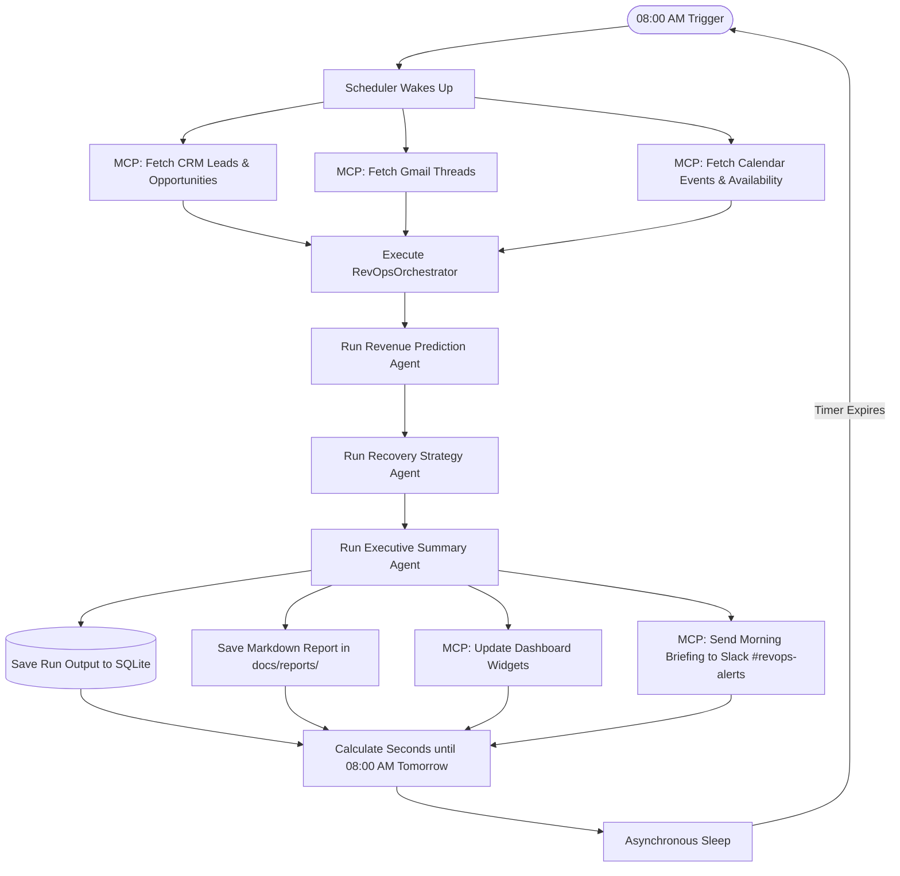
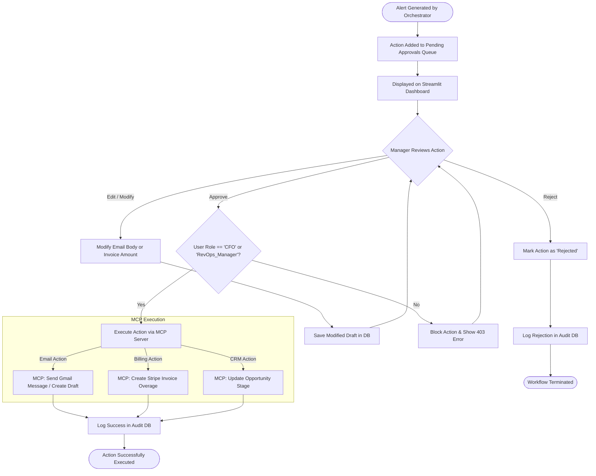
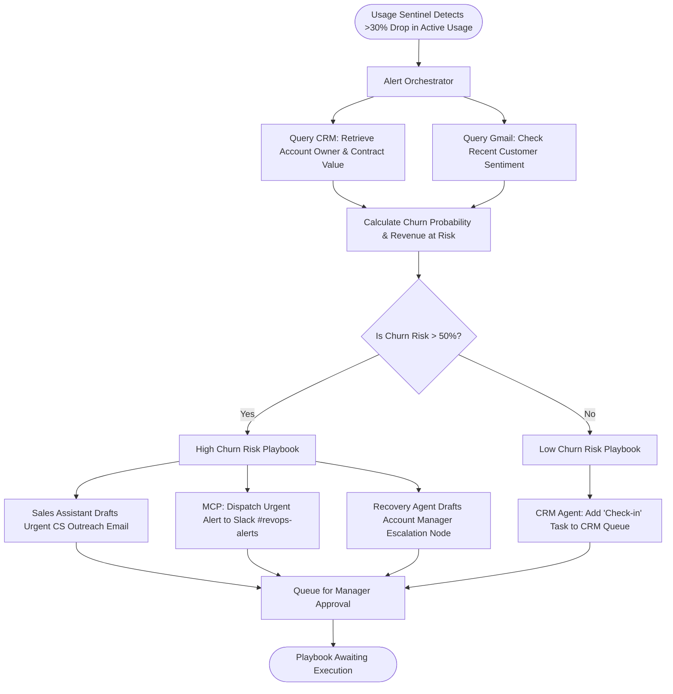
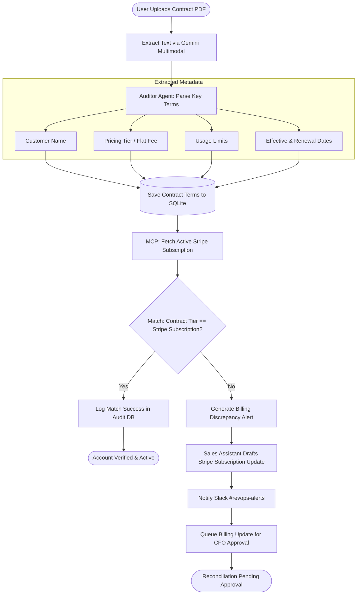

# Revenue Guardian: Workflow Diagrams

This document contains a set of Mermaid workflow diagrams visualizing the operational processes, approval lifecycles, and automated playbooks of the **Revenue Guardian** platform.

---

## 1. Autonomous Daily Auditing Workflow
Visualizes the daily schedule loop managed by the background scheduler.

---

## 2. Human-in-the-Loop (HITL) Approval Lifecycle
Illustrates the governance process protecting financial and client-facing operations.

---

## 3. Telemetry-Based Churn Recovery Playbook
Visualizes the automated playbook triggered by a sudden drop in product usage.

---

## 4. Contract Ingestion & Billing Reconciliation
Illustrates the workflow for onboarding a new contract and verifying billing setup.

